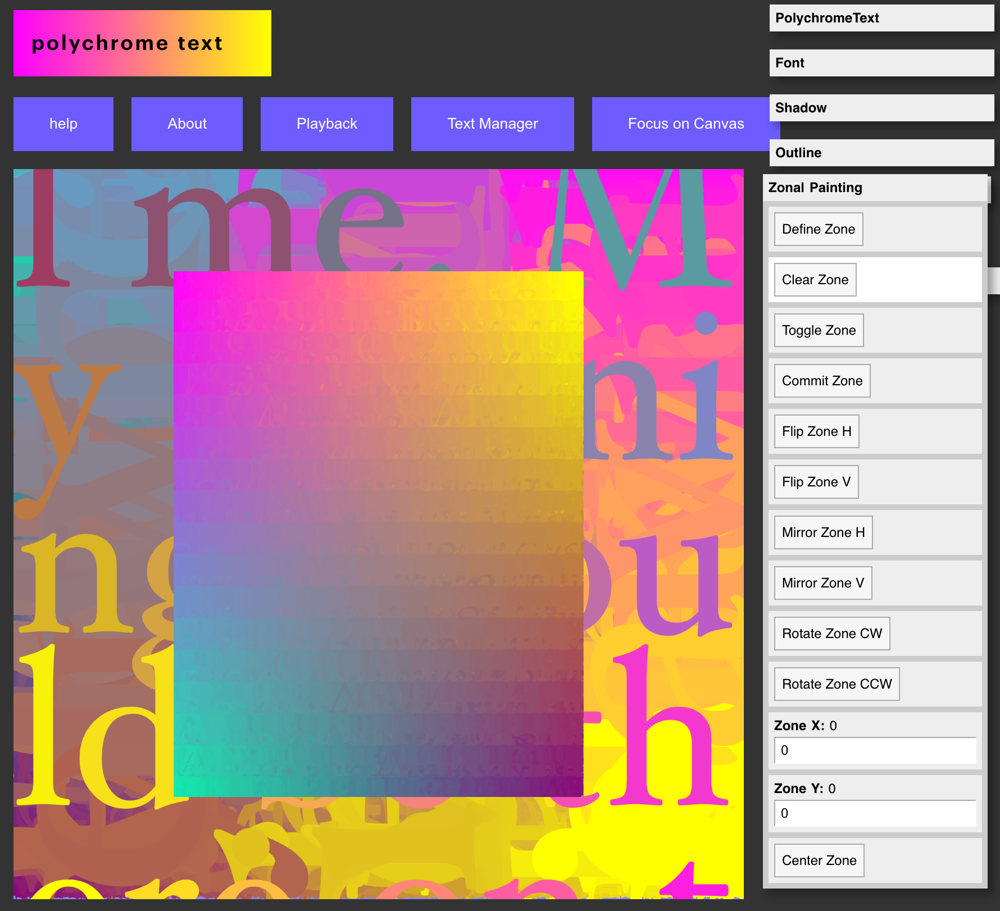

# Polychrome Text - p5.js version
Online @ https://michaelpaulukonis.github.io/polychrome.p5/

## Poly-WHAT???
Polychrome - or many colors.

Traditionally, text and image are segregated in Western Art.

This web-app plays with those boundaries, providing an polychromatic text painting environment.

> Although the word polychrome is created from the combining of two Greek words, it was not used in ancient Greece. The term was coined in the early nineteenth century by Antoine Chrysostôme Quatremère de Quincy. ([source](https://en.wikipedia.org/wiki/Ancient_Greek_art#Polychromy))




## Animations

Output multiple images
Run the `pcttool` to stitch them together using `ffmpeg` and  ImageMagick's `convert`

- `brew install ffmpeg` and `brew install imagemagick`
- more options at [StackOverflow](https://askubuntu.com/a/837574/613420)

See below for some ffmpeg notes


## Previous version
Conversion of my Processing.js text-app from [WebText sketches](https://github.com/MichaelPaulukonis/WebText)

Previous version online @ http://www.xradiograph.com/netart/024.html

## Dev notes
THIS IS A HORRIBLE MISH-MASH of procedural code, wannabe-functional-light code, and un-planned cowboy coding
GUI and core function are intermingled (although less so than originally)


## Macros

They're not recordings of actions (although that was the original idea). They're preprogrammed actions.
They are evolving, which is good.

## UI

https://github.com/bit101/quicksettings => the raw, unwrapped version looks like it should work better than the p5 gui wrapper
The "wrapper" requires the variables to be globals. UGH.
IT does not appear to work with object parameters

http://repo.zebkit.org/latest/samples/uidemo.html#


## Scripting

It is now possible to record and playback most activity.
Not all of it is recorded correctly, and needs work.
Also, I'd really like to extend it by a simple language (ay-yi-yi) to allow for some looping.
Have a look at https://www.npmjs.com/package/tracery-grammar and https://github.com/kyranet/tracery

https://shiffman.net/a2z/cfg/


## ffmpeg

This will take all png files in a folder and make one .mp4 from all them.
The size will be of the largest image, with all other images centered (unscaled) and padded with black.
See [notes on `pad`](http://ffmpeg.org/ffmpeg-filters.html#pad) for more.


`ffmpeg -r 15 -f image2 -pattern_type glob -i '*.png' -vf pad="max(iw\,ih):ow:(ow-iw)/2:(oh-ih)/2" -vcodec libx264 -crf 17 -pix_fmt yuv420p 'combined.mp4'`


```
mogrify -path '/home/hamy/Documents/JP2_Wrangling/2DArtist_066/Processed' -verbose -quality 95 -format jpg *.jp2

magick mogrify -path './' -verbose  -format png *.jp2

magick mogrify -path './' -verbose -format jpg *.jp2

mkdir denslow
pdfimages -verbose -j denslow.goose.2003goudy25765.pdf ./denslow
```

for FILENAME in $(ls *.bpm; do convert $FILENAME ${FILENAME%.*}.png 

for x in *.webp; do dwebp {} -o ${x%.*}.png ::: $x; done

for x in *.bpm; do convert ${x%.*}.png ::: $x; done

convert *.pbm -set filename:fn '%[basename]' '%[filename:fn].png'

